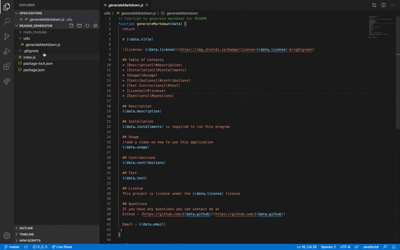

  # README GENERATOR

  

  ## Table of Contents 
  * [Description](#description)
  * [Installation](#installments)
  * [Usage](#usage)
  * [Contributions](#contributions)
  * [Test Instructions](#test)
  * [License](#license)
  * [Questions](#questions)

  ## Description
  AS A developer
I WANT a README generator
SO THAT I can quickly create a professional README for a new project

  ## Installation
  Node is required to run this program. Select index.js file and open it on the terminal so that you can install the dependencies by typing "npm i".

  ## Usage 
  //add a video on how to use this application 
  hfjdka

  ## Contributions
  None 

  ## Test 
  
  

  ## License
  This project is license under the MIT license 

  ## Questions
  If you have any questions you can contact me at  
  Github - [https://github.com/Droman09](https://github.com/Droman09)

  Email - David_roman09@yahoo.com
